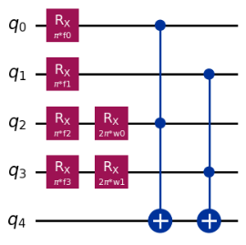

# FLIQ 2025 – Phase Classification in a Rydberg Chain  

**Hackathon:** Future Leaders in Quantum 2025  
**Team:** NotJustAPhase (2nd Place)  
**Task:** Classify the phase of a 51-atom Rydberg system from classical shadow measurements of an unknown quantum state using a variational quantum model of our own design.

### Overview
The project focuses on identifying $Z_2$ and $Z_3$ ordered phases in a 51-atom Rydberg chain based on measurement data from its ground states. The goal was to demonstrate efficient phase discrimination using a quantum variational model with as few qubits and trainable parameters as possible.

### Approach
- Converted raw measurement outcomes of an unknown quantum state into averaged qubit expectation values and found the first four qubits to be sufficient for complete phase discrimination, eliminating the need for all 51-atom measurements.  
- Designed a 5-qubit variational circuit with $R_X$ feature encoding and two trainable parameters. The first two data qubits were left unoptimised as the ends of the Rydberg chain exhibited the strongest expectation values in the true ground state, allowing a reduced parameter count without loss of accuracy.
- Optimised parameters using COBYLA to minimise mean-squared error between model predictions and true phase labels.

  
*Figure: The 5-qubit variational circuit used for phase classification. Four features are encoded via single-qubit RX rotations, followed by two trainable RX parameters.*

### Results
| Metric | Value |
|---------|-------|
| Accuracy | 100% |
| Qubits | 5 |
| Parameters | 2 |
| Transpiled circuit depth | 20 |
| Final MSE | 4.8×10⁻⁸ |
